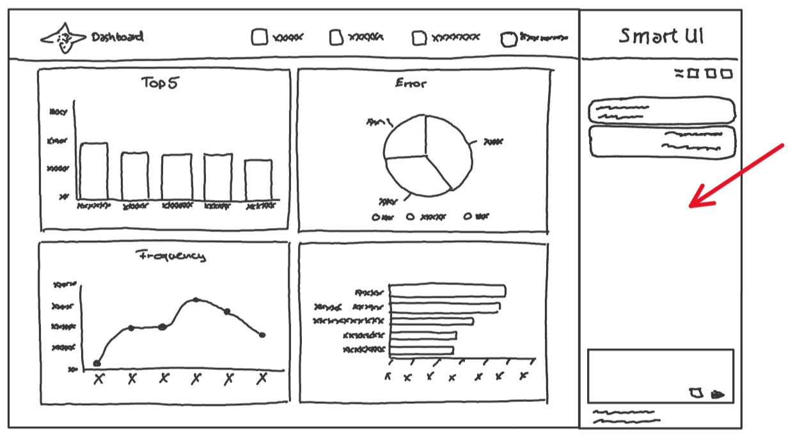
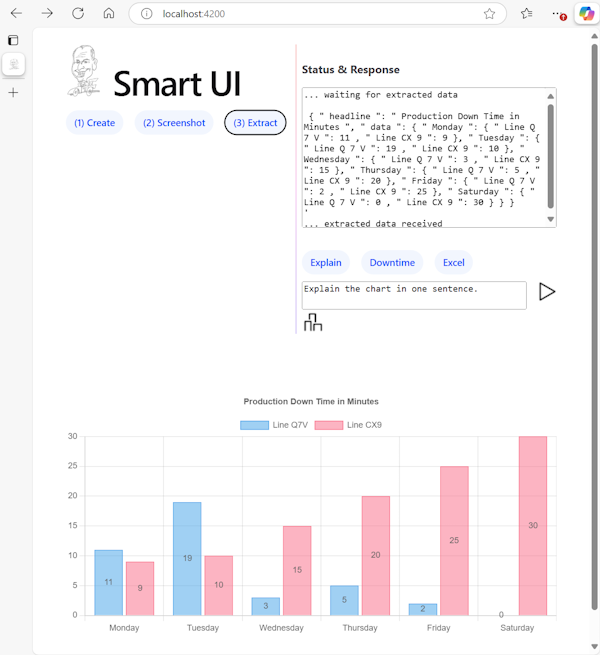
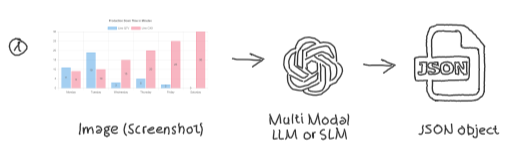
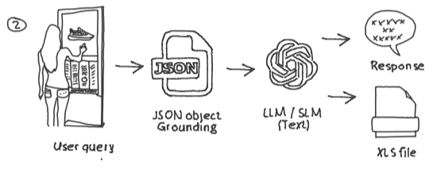
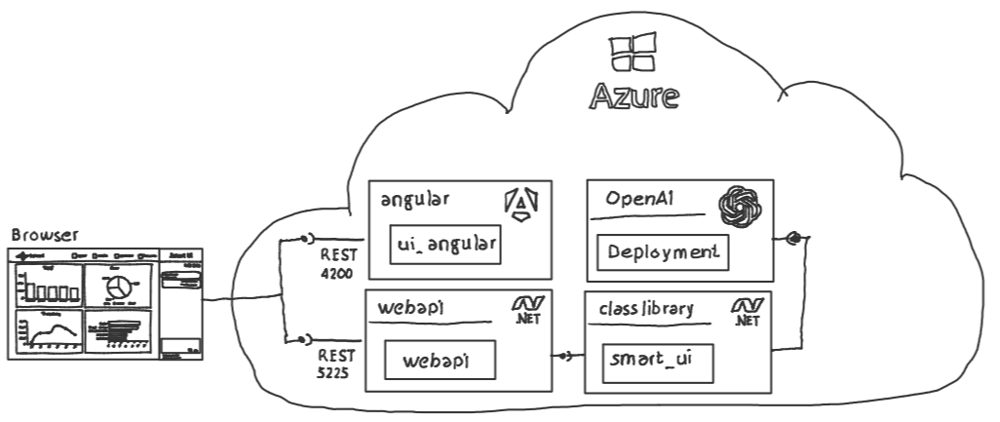

# Smart UI

## Chat with your UI

Legacy applications increasingly need AI empowerment to stay relevant and competitive.

Integrating AI can enhance these applications by providing easy access to additional functionalities, enriching user interfaces, and simplifying user interactions. This transformation not only improves efficiency but also offers a more intuitive and engaging user experience with existing business critical applications.

Copilot-like chat functionalities, which offer Retrieval-Augmented Generation (RAG) or “Chat with your Data” capabilities, are now being integrated into existing applications. This approach is both valid and reasonable, enhancing the utility and user experience of these applications.

However, it is also worth considering the implementation of ‘Chat with your existing UI’ as an additional or even primary functionality. This would allow users to interact more intuitively with the familiar interface, further improving accessibility and efficiency.



Multi-modal models have the capability to process both image and text data. This functionality allows for a more comprehensive analysis of information presented in existing user interfaces and is used in this sample repository to implement "Chat with your UI" functionality.

### Sample Application

The sample application within this repository simulates a legacy application that displays data in a bar chart.



### Implementation Steps

The "Chat with your UI" functionality is implemented by:

1) **Extracting information** shown in the bar chart by taking a screenshot and using a multi-modal LLM (OpenAI GPT-4o) to extract information. The extracted information is provided as a JSON object. 
2) The extracted JSON information is **used to ground user questions** and to export the data to an Excel spreed sheet. 

### Application

Click on:

- **(1) Create**: to retrieve demo data from the webapi and to create a bar chart.
- **(2) Screenshot**: to create a screenshot from the bar chart and upload it to the webapi.
- **(3) Extract**: to extract data from the uploaded screenshot. You will see the following interface:


From here you can ask questions which will be answered based on the extracted bar chart data. Hover over **Explain**, **Downtime** or **Excel** to see sample user prompts like:

- "Explain the chart in one sentence"
- "Which production line has downtime on Saturday and on Monday?"
- "Create an Excel file with the chart data!"

## Solution Components

The repo contains the following projects:



- [Angular Web App](./src/ui_angular/):
  - Hosted on port 4200
  - Provides the user interface
  - Communicates with the [webapi](./src/webapi/) backend
- [webapi](./src/webapi/):
  - "Thin" REST wrapper of [smart_ui class library](./src/smart_ui/)
  - Hosted on port 5225
  - `app.MapGet("/getdata", async (HttpContext context)`: Provides demo data to create a bar chart
  - `app.MapPost("/uploadchart", async (HttpContext context)`: Accepts screenshot image: 
  - `app.MapGet("/extractdata", async (HttpContext context)`: Extracts screenshot data: 
  - `app.MapGet("/responsestream", async (HttpContext context)`: Provides chat completion interface (streaming)
- [smart_ui](./src/smart_ui/):
  - c# class library
    - `Task<Intent> DetectIntent(string userMessage)`: Detects intent of user query. The demo application detects [QueryData & ExortData](./src/smart_ui/UserRequest_Intent.cs)
    - `Task<ChartData> GetData()`: Provides sample data to create a bar chart within the [Angular UI](./src/ui_angular/).
    - `IAsyncEnumerable<string> ExtractData(string userMessage, string fileName)`: Communicates with an Azure OpenAI LLM (GPT4-o) to extract data from the previously provided screenshot and provides the information as JSON object.
    - `IAsyncEnumerable<string> CreateDataCompletion(string userMessage, string data)`: Answers user questions based on the extracted chart data.
    - `Task<bool> CreateXlsFile(string data, string fileName)`: Exports the extracted chart data to an Excel file.

## Run the sample app

### Environment

- Execute the Azure CLI script (Powershell) [setup.azcli](./setup/setup.azcli) to create the necessary Azure services (Azure OpenAI, model deployment, storage account ...). The script stores all necessary connection strings in `./config/config.env`. If there are already existing Azure OpenAI resources the [./config/config.env.template](./config/config.env.template) can be renamed and the connection information can be provided within.
- Start the [Angular UI](./src/ui_angular/) by executing:
  
  ```powershell
    cd ./src/angular_ui
    npm install
    ng serve
    ```

    or press "F5" within Visual Studio. Ensure that you have Node.js and all necessary Angular components installed.

- Open a new powershell terminal windows and start the [c# webapi](./src/webapi/) by executing:

    ```dotnetcli
    cd ./src/webapi
    SETX ASPNETCORE_URLS "http://localhost:5225"
    dotnet run
    ```

    Ensure that the webapi is listening on port 5225

- Open a browser and point it to `http://localhost:4200`

## Summary

This repository demonstrates the integration of AI into legacy applications to enhance user interfaces and interactions. The sample application showcases a "Chat with your UI" functionality, where GPT-4o is used to extract data from a screenshot of a bar chart. 

Additionally, Azure AI offers various other services such as [Azure AI Content Understanding](https://azure.microsoft.com/en-us/products/ai-services/ai-content-understanding?msockid=0aec1c5731de617d2576095d30a160c2), [Azure AI Document Intelligence)(https://azure.microsoft.com/en-us/products/ai-services/ai-document-intelligence?msockid=0aec1c5731de617d2576095d30a160c2)... that can be utilized for similar purposes.

Moreover, fine-tuned SLMs with multi-modal capabilities, like models from the Phi family, and a deep understanding of the specific legacy charts can further enhance the application's functionality and user experience.
